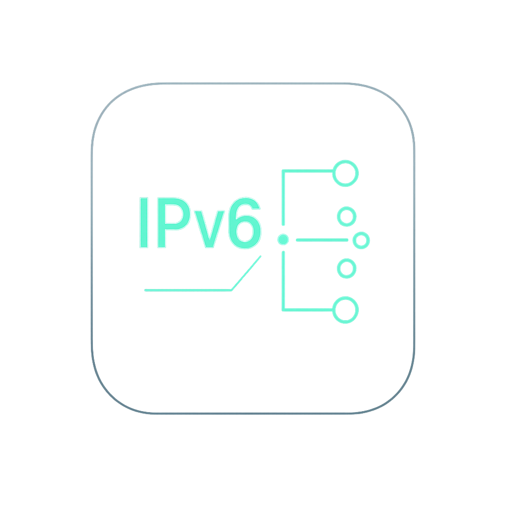

# IPv6PrefixHelper

  

  <strong>Automatic IPv6 Recovery for macOS</strong> 
  Detects broken IPv6 prefixes and fixes them instantly.

🇩🇪 Über IPv6PrefixHelper

IPv6PrefixHelper ist eine kleine, spezialisierte macOS-Menüleisten-App, die ein bekanntes Problem vieler UniFi-/Ubiquiti-Setups umgeht: fehlende oder eingefrorene IPv6 Router Advertisements (RA).
Wenn macOS dadurch das globale IPv6-Präfix verliert, bleibt zwar eine ULA-Adresse bestehen, aber IPv6-Konnektivität bricht ab — oft ohne sichtbaren Hinweis.

Die App erkennt diesen Zustand automatisch, überwacht sowohl WLAN als auch Ethernet, protokolliert Änderungen des globalen Präfixes und ihrer Default-Route und führt bei Bedarf einen automatischen IPv6-Fix auf dem Ethernet-Interface durch.
Alle Aktionen werden vollständig lokal ausgeführt, ohne Netzwerkverkehr an Dritte, ohne Cloud-Abhängigkeiten und ohne Hintergrunddienste außerhalb der App.

Ziel des Projekts ist kein generischer Netzwerkmonitor, sondern ein schlankes, robustes Werkzeug für genau dieses Problem: „Prefix verloren → IPv6 nicht funktional → automatisch beheben.“

---

## ✨ Features

- Automatische Überwachung des IPv6-Status
- Erkennung von:
  - fehlenden RA-Paketen
  - verlorenen Präfixen
  - fehlender IPv6-Default-Route
  - Präfix-Mismatch zwischen WLAN und Ethernet
- Automatische Reparatur von IPv6 auf Ethernet:
  - Bezug einer neuen IPv6 via Auto-Modus
  - Wechsel zurück zu manuell mit gültiger Adresse
- Lokalisierung: **Deutsch** & **Englisch** vollständig unterstützt
- Debug-Fenster mit vollständigem Log
- Minimaler Ressourcenbedarf, komplett lokal, keine Cloud-Verbindungen

---

## 🔧 Installation

Aktuell gibt es **keine notarisierten Releases**.  
Du kannst die App auf zwei Arten erhalten:

### 1. Selbst kompilieren (empfohlen)
- Xcode 15 oder neuer
- Projekt klonen
- Build & Run

### 2. Vorgefertigte Binary (nicht notarisiert)
macOS verlangt beim ersten Start eine manuelle Bestätigung in den Systemeinstellungen unter  
**Sicherheit & Datenschutz → App erlauben**.

---

## 🧪 Kompatibilität

Getestet unter:

- macOS Sonoma (14.x)
- UniFi Cloud Gateway Ultra
- Weitere Router, die IPv6-RA-Probleme aufweisen könnten

---

## 📄 Lizenz

Dieses Projekt steht unter der **GNU GPLv3**.  
Das bedeutet u. a.:

- freie private & kommerzielle Nutzung des Quellcodes
- Änderungen dürfen veröffentlicht werden
- Weitergabe von Binaries erfordert Bereitstellung des (modifizierten) Quellcodes
- keine proprietären Forks erlaubt

👉 Die vollständige Lizenz findest du in der Datei `LICENSE`.

---

# English Version

# IPv6PrefixHelper

🇬🇧 About IPv6PrefixHelper

IPv6PrefixHelper is a small, purpose-built macOS menu bar application designed to work around a well-known issue in many UniFi/Ubiquiti environments: missing or stale IPv6 Router Advertisements (RA).
When macOS loses its global IPv6 prefix, a ULA address may remain, but IPv6 connectivity silently breaks — often without any obvious indication.

The app continuously monitors both Wi-Fi and Ethernet, tracks changes in global prefixes and default routes, and performs an automatic IPv6 repair on the Ethernet interface whenever required.
All actions happen entirely locally on the system — no cloud calls, no remote logging, no external services.

This project is not intended to be a general-purpose network utility, but a precise tool built for one task:
“Prefix lost → IPv6 broken → automatically fix the interface.”
---

## ✨ Features

- Automatic IPv6 monitoring
- Detection of:
  - missing RA packets
  - lost IPv6 prefixes
  - missing IPv6 default route
  - prefix mismatch between Wi-Fi and Ethernet
- Automatic repair mechanism:
  - temporarily switch to auto IPv6
  - capture valid address & router
  - switch back to manual mode with correct values
- Full localization support (English & German)
- Debug window with live log
- No external dependencies, no cloud calls

---

## 🔧 Installation

### 1. Build from source (recommended)
- Requires Xcode 15 or later
- Clone repo → Build → Run

### 2. Prebuilt binary (not notarized)
macOS requires manual approval before the app can run  
**System Settings → Privacy & Security → Allow Anyway**.

---

## 🧪 Compatibility

Tested on:

- macOS Sonoma (14.x)
- UniFi Cloud Gateway Ultra
- Other routers with RA issues

---

## 📄 License

Licensed under **GNU GPLv3**.

This requires:

- source availability when redistributing
- derivative works must also be GPLv3
- no closed-source forks allowed

See the `LICENSE` file for full terms.

---

If you appreciate this project, feel free to ⭐ star the repo on GitHub!
